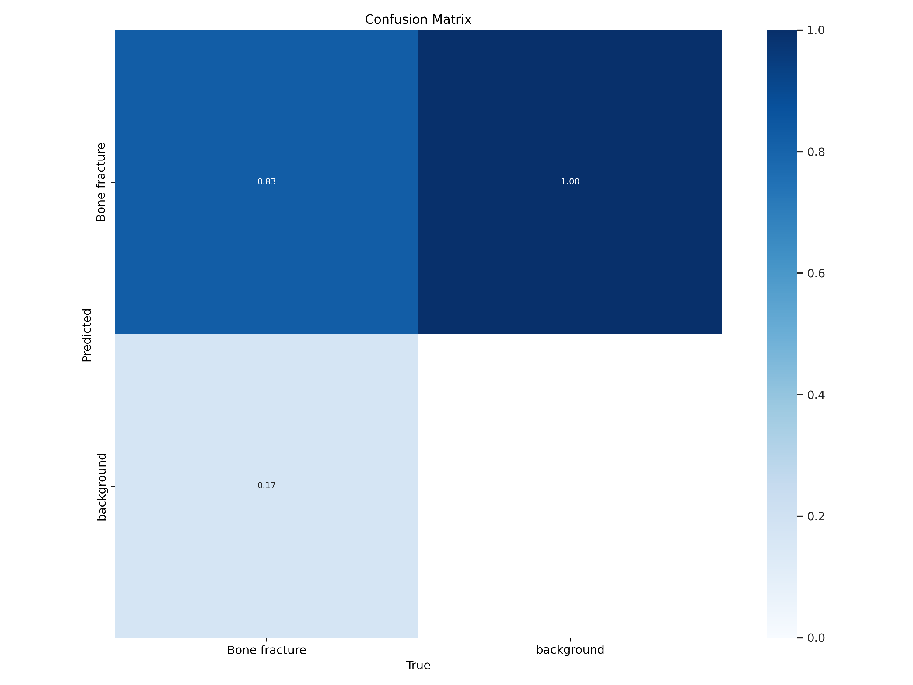
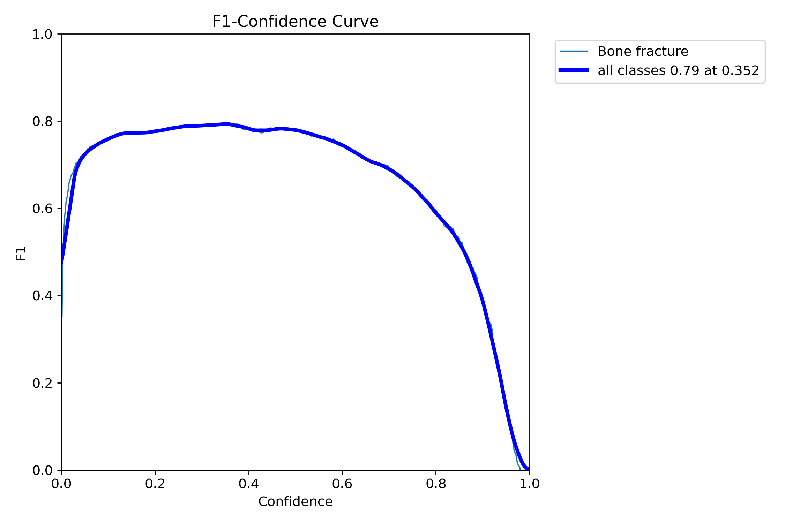

# X-ray-fracture-detection
This deep learning project applies the YOLO object detection algorithm to detect bone fractures in X-ray images. The aim is to support doctors and researchers by providing a fast, accurate, and automated tool for medical imaging.

## 🎯 Project Goals
- Help doctors detect fractures faster and reduce human errors.  
- Reduce the time needed to diagnose medical images (improve diagnostic speed).  
- Facilitate automated analysis of large medical datasets.  

---

## 🛠️ Technologies & Tools
- Python  
- PyTorch  
- OpenCV  
- YOLOv5  
- NumPy 

---

## 📊 Model Performance

### Confusion Matrix
Here is the confusion matrix showing the model performance on the test dataset:  

### F1 Curve
The F1 curve shows the balance between precision and recall for the model:  

---

## 📷 Output Examples
Here are some examples of the fracture detection results:  

.png)  
.png)  

> These results demonstrate the model's capability in detecting fractures reliably.

---

